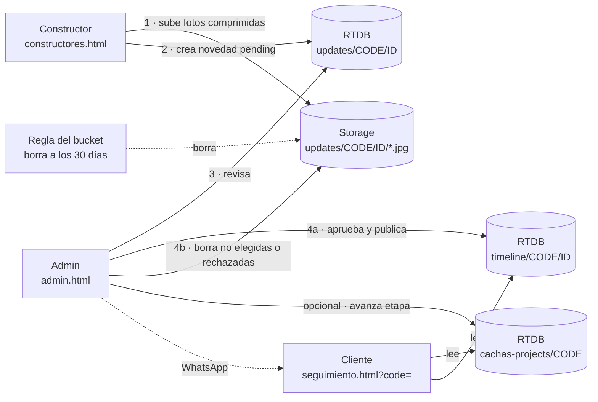

# Plan: Portal de constructores (seguimiento de producción)

> **Actualización 2026-09-28 — enfoque cambiado a plan Spark (sin costo, sin apps extra).** Sin Storage ni Cloud Functions: fotos comprimidas (~1200 px) guardadas en la RTDB en un nodo aparte; roles en la RTDB y admins por correo en las reglas; cuentas de constructores creadas desde el panel; borrado de fotos vencidas lo hace el panel admin al abrirse. **Fase 1 hecha** (admin.html con Google, reglas cerradas, teléfonos privados). Las secciones con Storage/Functions/claims abajo se reescribirán al llegar a cada fase.

- **Estado**: propuesta
- **Fecha**: 2026-09-28
- **Contexto del sitio**: `CLAUDE.md`

## 0. Resumen

El flujo completo tiene cuatro pasos:

1. Los constructores entran a **`constructores.html`** con usuario y contraseña. Ven solo los proyectos que tienen asignados.
2. En cada proyecto suben **novedades**: texto, fotos y, si quieren, la etapa que proponen.
3. El admin/supervisor las revisa en **`admin.html`**, el panel actual movido fuera de seguimiento:
   - **Aprobar**: elige qué fotos ve el cliente. Puede mover la etapa y avisar por WhatsApp.
   - **Rechazar**: deja una nota.
4. El cliente ve en `seguimiento.html?code=…` una **línea de tiempo** con las novedades aprobadas.

**Fotos**:
- Se guardan en **Firebase Storage**.
- El celular las comprime antes de subirlas (~300 KB cada una, sin EXIF/GPS).
- **Se borran solas a los 30 días**. Las rechazadas y las no elegidas se borran en el momento de la revisión.

**Prerrequisito**: hoy la base de datos está abierta (ver `CLAUDE.md` §8). La Fase 1 pasa el admin a Firebase Auth y cierra las reglas **antes** de sumar usuarios nuevos.

## 1. Decisiones

**Ya tomadas** (respuestas del 2026-09-28):

| Tema | Decisión |
|---|---|
| Fotos | Firebase Storage, mismo proyecto. Requiere plan **Blaze** con alerta de presupuesto; el uso esperado cabe en la capa gratuita (§9). |
| Retención | Pendientes y aprobadas se borran **a los 30 días** con una regla del bucket, sin código. Las rechazadas y las no elegidas al aprobar se borran **al instante**. |
| Qué ve el cliente | Solo novedades **aprobadas**. |
| Etapa | El constructor **propone** y el admin confirma. |
| Login de constructores | **Usuario + contraseña**. El admin crea la cuenta desde el panel. |

> **¿Borrar al aprobar?** Se puede: es la misma llamada que al rechazar. Pero si se borran todas, el cliente no vería ninguna foto. Por eso, al aprobar se borran **solo las fotos que el supervisor no elige** y las elegidas quedan visibles hasta cumplir 30 días. Si prefieren borrar todo al aprobar, basta con marcar todas como "no publicar".

**Decisiones de diseño** (mías, ajustables):

- **El panel admin sale de `seguimiento.html` y pasa a `admin.html`.** Así la página del cliente queda liviana y el panel, que va a crecer con Equipo y Por revisar, tiene su propio espacio. Se mueve tal cual y encima se agregan las capas nuevas.
- **El admin entra con Google** (cuenta `cachashouse@gmail.com` u otras de una lista). No hay contraseña que compartir y el correo ya viene verificado.
- **Constructores con correo sintético**: `usuario@constructores.cachashouse.com`. No necesitan un email real; el formulario solo pide "usuario".
- **Roles como *custom claims*** en el token (`role: 'admin' | 'constructor'`). Las reglas de Storage no pueden leer la Realtime Database (el acceso cruzado solo existe con Firestore), pero sí leen claims, y las reglas de la RTDB también. Así hay una sola fuente de verdad. Para asignar claims hace falta el Admin SDK, por eso hay 4 Cloud Functions pequeñas (§5).

## 2. Arquitectura



**Qué se usa de cada servicio**:

| Pieza | Uso |
|---|---|
| GitHub Pages (sin cambios) | Sirve las 4 páginas y `js/cachas-firebase.js` |
| Firebase Auth | Google para admin; correo + contraseña para constructores |
| Realtime Database | Datos |
| Storage | Fotos |
| Cloud Functions | Cuentas y roles |

**Scripts compat por página** (todos en la misma versión, hoy 9.22.0):

| Página | Scripts |
|---|---|
| `seguimiento.html` | app, database |
| `constructores.html` | + auth, storage |
| `admin.html` | + auth, storage, functions |

## 3. Modelo de datos

**Realtime Database**. Lo existente no cambia de forma; solo se mueve el teléfono.

```text
cachas-projects/{code}           público por código · escribe admin              (existe)
  client, project, status, deliveryDate, delayReason, updatedAt
cachas-private/{code}            solo admin                                      (nuevo; aquí pasa `phone`)
  phone, notes
timeline/{code}/{updateId}       público por código · escribe admin              (nuevo: lo que ve el cliente)
  text, stage, photos/{pid}{url,w,h}, publishedAt, photosExpireAt
updates/{code}/{updateId}        admin + constructores asignados                 (nuevo: bitácora interna)
  authorUid, authorName, text, proposedStage,
  photos/{pid}{path,url,w,h,bytes},
  status: pending | approved | rejected,
  createdAt, reviewedBy, reviewedAt, reviewNote
users/{uid}                      admin lee todo · cada uno lee el suyo · escriben Functions   (nuevo)
  username, name, email, role, active, createdAt
assignments/{code}/{uid}: true   admin                                           (nuevo)
user-projects/{uid}/{code}: true admin escribe · el usuario lee el suyo          (nuevo: índice inverso)
```

**Por qué `timeline` va aparte de `cachas-projects`**:
- La RTDB no puede filtrar lecturas por `status`, así que la copia pública solo contiene lo aprobado y sin datos internos.
- La tabla admin (`on('value')` sobre `cachas-projects`) no descarga las líneas de tiempo con cada cambio.

**Storage**:

```text
updates/{code}/{updateId}/{pid}.jpg    JPG ≤ 3 MB, ~1600 px, sin EXIF · se borra a los 30 días de subido
```

- El cliente ve las fotos por su *download URL* (con token), guardada en `timeline`. Las URLs de fotos pendientes solo existen en `updates`, que el público no puede leer.
- Los 30 días se cuentan desde la subida. Si se aprueba el día 10, el cliente la ve 20 días más. `photosExpireAt` permite ocultarla a tiempo, porque la regla del bucket puede tardar un poco en borrar.

## 4. Reglas de seguridad

### 4.1 `firebase/database.rules.json`

```json
{
  "rules": {
    "cachas-projects": {
      ".read": "auth != null && auth.token.role === 'admin'",
      "$code": {
        ".read": true,
        ".write": "auth != null && auth.token.role === 'admin'"
      }
    },
    "cachas-private": {
      ".read": "auth != null && auth.token.role === 'admin'",
      ".write": "auth != null && auth.token.role === 'admin'"
    },
    "timeline": {
      "$code": {
        ".read": true,
        ".write": "auth != null && auth.token.role === 'admin'"
      }
    },
    "users": {
      ".read": "auth != null && auth.token.role === 'admin'",
      "$uid": { ".read": "auth != null && auth.uid === $uid" }
    },
    "assignments": {
      ".read": "auth != null && auth.token.role === 'admin'",
      ".write": "auth != null && auth.token.role === 'admin'"
    },
    "user-projects": {
      ".write": "auth != null && auth.token.role === 'admin'",
      "$uid": { ".read": "auth != null && (auth.uid === $uid || auth.token.role === 'admin')" }
    },
    "updates": {
      ".read": "auth != null && auth.token.role === 'admin'",
      "$code": {
        ".read": "auth != null && auth.token.role === 'constructor' && root.child('users/' + auth.uid + '/active').val() === true && root.child('assignments/' + $code + '/' + auth.uid).exists()",
        "$updateId": {
          ".write": "auth != null && (auth.token.role === 'admin' || (auth.token.role === 'constructor' && !data.exists() && root.child('users/' + auth.uid + '/active').val() === true && root.child('assignments/' + $code + '/' + auth.uid).exists()))",
          ".validate": "newData.hasChildren(['authorUid', 'text', 'status', 'createdAt'])",
          "authorUid":     { ".validate": "newData.val() === auth.uid || auth.token.role === 'admin'" },
          "authorName":    { ".validate": "newData.isString() && newData.val().length <= 60" },
          "text":          { ".validate": "newData.isString() && newData.val().length <= 2000" },
          "status":        { ".validate": "newData.val() === 'pending' || (auth.token.role === 'admin' && (newData.val() === 'approved' || newData.val() === 'rejected'))" },
          "proposedStage": { ".validate": "newData.isNumber() && newData.val() >= 0 && newData.val() <= 6" },
          "createdAt":     { ".validate": "newData.isNumber()" },
          "photos":        { "$pid": { ".validate": "newData.hasChildren(['path', 'url'])" } },
          "reviewedBy":    { ".validate": "auth.token.role === 'admin'" },
          "reviewedAt":    { ".validate": "auth.token.role === 'admin'" },
          "reviewNote":    { ".validate": "auth.token.role === 'admin' && newData.isString()" },
          "$other":        { ".validate": false }
        }
      }
    }
  }
}
```

**Cómo leer estas reglas**:
- **Cliente**:
  - puede leer `cachas-projects/ABC-123` y `timeline/ABC-123` si conoce el código;
  - no puede listar ni escribir nada.
- **Constructor**:
  - puede crear novedades solo en proyectos asignados, solo como `pending` y a su nombre;
  - no puede editarlas ni borrarlas después;
  - `active: false` le corta el acceso a la base al instante.
- **Cuenta sin rol** (por ejemplo, alguien que se registre por la API con la clave pública): no puede hacer nada.

### 4.2 `firebase/storage.rules`

```text
rules_version = '2';
service firebase.storage {
  match /b/{bucket}/o {
    match /updates/{code}/{updateId}/{fileName} {
      function isTeam() {
        return request.auth != null
          && request.auth.token.role in ['admin', 'constructor'];
      }
      allow read:   if isTeam();                 // getDownloadURL necesita lectura
      allow create: if isTeam()
                    && request.resource.size < 3 * 1024 * 1024
                    && request.resource.contentType == 'image/jpeg';
      allow delete: if request.auth != null && request.auth.token.role == 'admin';
    }
  }
}
```

Storage no puede validar asignaciones porque no lee la RTDB. Un constructor podría subir a la carpeta de otro proyecto, pero esa foto nunca queda enlazada (la base lo impide) y se borra sola a los 30 días.

### 4.3 Regla de ciclo de vida del bucket: `firebase/storage-lifecycle.json`

```json
{
  "lifecycle": {
    "rule": [
      { "action": { "type": "Delete" }, "condition": { "age": 30, "matchesPrefix": ["updates/"] } }
    ]
  }
}
```

Hay dos formas de aplicarla:

**Por consola** (Google Cloud Console → Cloud Storage → Buckets → *tu bucket*):
1. Pestaña **Lifecycle** → **Add a rule**.
2. Acción: **Delete object**.
3. Condiciones: **Age** 30 días y **Object name matches prefix** `updates/`.

**Por CLI**:

```bash
gcloud storage buckets update gs://cachashouse-322a2.firebasestorage.app --lifecycle-file=firebase/storage-lifecycle.json
```

Usa el nombre de bucket que muestre la consola.

## 5. Cloud Functions (`firebase/functions/index.js`)

```js
const { onCall, HttpsError } = require('firebase-functions/v2/https');
const { setGlobalOptions } = require('firebase-functions/v2');
const { initializeApp } = require('firebase-admin/app');
const { getAuth } = require('firebase-admin/auth');
const { getDatabase } = require('firebase-admin/database');

initializeApp();
setGlobalOptions({ region: 'us-central1', maxInstances: 2 });

const ADMIN_EMAILS = ['cachashouse@gmail.com'];              // quién puede ser admin
const TEAM_EMAIL_DOMAIN = 'constructores.cachashouse.com';    // correos sintéticos

const requireAdmin = (req) => {
  if (req.auth?.token?.role !== 'admin') throw new HttpsError('permission-denied', 'Solo admin');
};

// Bootstrap: da el rol admin a un correo verificado de la lista (se llama al entrar a admin.html)
exports.claimAdmin = onCall(async (req) => {
  const t = req.auth?.token;
  if (!t?.email_verified || !ADMIN_EMAILS.includes(t.email)) {
    throw new HttpsError('permission-denied', 'Cuenta no autorizada');
  }
  await getAuth().setCustomUserClaims(req.auth.uid, { role: 'admin' });
  await getDatabase().ref(`users/${req.auth.uid}`).update({
    name: t.name || t.email, email: t.email, role: 'admin', active: true,
  });
  return { ok: true };
});

exports.createConstructor = onCall(async (req) => {
  requireAdmin(req);
  const username = String(req.data?.username || '').trim().toLowerCase();
  const name = String(req.data?.name || '').trim() || username;
  const password = String(req.data?.password || '');
  if (!/^[a-z0-9._-]{3,20}$/.test(username)) throw new HttpsError('invalid-argument', 'Usuario: 3–20 caracteres (a-z, 0-9, . _ -)');
  if (password.length < 8) throw new HttpsError('invalid-argument', 'La contraseña debe tener al menos 8 caracteres');
  const user = await getAuth().createUser({ email: `${username}@${TEAM_EMAIL_DOMAIN}`, password, displayName: name });
  await getAuth().setCustomUserClaims(user.uid, { role: 'constructor' });
  await getDatabase().ref(`users/${user.uid}`).set({ username, name, role: 'constructor', active: true, createdAt: Date.now() });
  return { uid: user.uid };
});

exports.setConstructorPassword = onCall(async (req) => {
  requireAdmin(req);
  const { uid, password } = req.data || {};
  if (!uid || String(password || '').length < 8) throw new HttpsError('invalid-argument', 'Datos inválidos');
  await getAuth().updateUser(uid, { password });
  await getAuth().revokeRefreshTokens(uid);
  return { ok: true };
});

exports.setConstructorActive = onCall(async (req) => {
  requireAdmin(req);
  const { uid, active } = req.data || {};
  if (!uid) throw new HttpsError('invalid-argument', 'Falta uid');
  await getAuth().updateUser(uid, { disabled: !active });
  if (!active) await getAuth().revokeRefreshTokens(uid);
  await getDatabase().ref(`users/${uid}/active`).set(!!active);
  return { ok: true };
});
```

**Notas**:
- `firebase init functions` genera el `package.json` con versiones actuales. Usa Node 22.
- Después de cambiar claims, el cliente debe refrescar el token con `getIdTokenResult(true)`.

## 6. Pantallas y flujos

### 6.1 Constructor: `constructores.html`

Página nueva, pensada primero para el celular, con `noindex`. Hereda tokens y estilos de seguimiento. La sesión queda guardada en el teléfono.

**Pantallas**:
1. **Login**: usuario + contraseña → `auth.signInWithEmailAndPassword(username + '@' + TEAM_EMAIL_DOMAIN, password)`. Si el token no trae `role` `constructor` o `admin`, cierra sesión y muestra error.
2. **Mis proyectos**: lee `user-projects/{uid}` y luego `cachas-projects/{code}` de cada código. Muestra nombre, cliente, etapa actual y entrega. Los activos primero (`status < 6`).
3. **Proyecto**: stepper de etapa (se reutiliza el de seguimiento) y la bitácora `updates/{code}`. Cada novedad lleva un chip *pendiente / aprobada / rechazada* y, si fue rechazada, la nota.
4. **Nueva novedad**:
   - texto (máx. 2000);
   - "proponer etapa" (select con `STAGES`; opcional);
   - fotos con `<input type="file" accept="image/*" multiple>` (en el celular ofrece cámara o galería), máximo 10, con vista previa;
   - barra de progreso;
   - botón **Enviar**, que se habilita cuando hay texto o fotos.

**Compresión** (en `js/cachas-firebase.js`):

```js
async function compressPhoto(file, max = 1600, quality = 0.8) {
  const bmp = await createImageBitmap(file, { imageOrientation: 'from-image' });
  const k = Math.min(1, max / Math.max(bmp.width, bmp.height));
  const w = Math.round(bmp.width * k), h = Math.round(bmp.height * k);
  const canvas = Object.assign(document.createElement('canvas'), { width: w, height: h });
  canvas.getContext('2d').drawImage(bmp, 0, 0, w, h);
  bmp.close?.();
  const blob = await new Promise(res => canvas.toBlob(res, 'image/jpeg', quality));
  return { blob, w, h };   // re-codificar en canvas elimina el EXIF (incluido el GPS de la casa del cliente)
}
```

Si `createImageBitmap` falla (formato raro o navegador viejo), hay dos salidas: cargar la foto en un `` y dibujarla igual, o mostrar "usa una foto JPG".

**Envío**: primero las fotos, después el registro.

```js
async function submitUpdate(code, text, proposedStage, files, onProgress) {
  const ref = db.ref(`updates/${code}`).push();          // genera el id sin escribir
  const photos = {};
  for (const [i, file] of files.entries()) {
    const { blob, w, h } = await compressPhoto(file);
    const pid = `p${i + 1}`, path = `updates/${code}/${ref.key}/${pid}.jpg`;
    const snap = await storage.ref(path).put(blob, { contentType: 'image/jpeg' });
    photos[pid] = { path, url: await snap.ref.getDownloadURL(), w, h, bytes: blob.size };
    onProgress?.(i + 1, files.length);
  }
  await ref.set({
    authorUid: auth.currentUser.uid,
    authorName: profile.name,                  // de users/{uid}
    text: text.trim(),
    proposedStage: proposedStage ?? null,      // null = no propone
    photos,
    status: 'pending',
    createdAt: firebase.database.ServerValue.TIMESTAMP,
  });
}
```

Si falla el `set`, las fotos subidas quedan huérfanas y se borran solas a los 30 días. La UI ofrece **Reintentar**.

### 6.2 Admin: `admin.html`

**Fase 1**: el panel actual se mueve tal cual. Cambios:
- **Login**: el campo de contraseña y `ADMIN_HASH` se reemplazan por el botón **Entrar con Google**:

  ```js
  async function loginAdmin() {
    const { user } = await auth.signInWithPopup(new firebase.auth.GoogleAuthProvider());
    let tok = await user.getIdTokenResult();
    if (tok.claims.role !== 'admin') {
      await fns.httpsCallable('claimAdmin')();        // falla si el correo no está en ADMIN_EMAILS
      tok = await user.getIdTokenResult(true);        // refresca para traer el claim
    }
    if (tok.claims.role !== 'admin') { await auth.signOut(); throw new Error('Sin permiso'); }
  }
  ```

- La sesión se mantiene con `auth.onAuthStateChanged`, y "cerrar sesión" usa `auth.signOut()`.
- **Teléfono**: la tabla lo lee de `cachas-private/{code}` y lo escribe ahí. El modal "nuevo proyecto" también.
- **WhatsApp**:
  - el armado del mensaje se extrae a `buildWhatsAppMsg(project, { newPhotos })`, que usa datos y no el DOM;
  - el link pasa a `https://cachashouse.com/seguimiento.html?code=`.

**Fase 2: Equipo**. Una sección nueva con:
- lista de `users` (nombre, usuario, activo);
- **+ constructor** (modal: nombre, usuario, contraseña) → `createConstructor`;
- **cambiar contraseña** → `setConstructorPassword`;
- **activar/desactivar** → `setConstructorActive`.

En la tabla de proyectos se agrega la columna **equipo**: chips con los asignados y un botón **+** para asignar. Cada cambio es un update multi-ruta:

```js
db.ref().update({ [`assignments/${code}/${uid}`]: true, [`user-projects/${uid}/${code}`]: true });  // null para quitar
```

**Fase 4: Por revisar**. Bandeja con un contador en el encabezado. Escucha `updates`, que es chico a esta escala, y filtra `pending`.

Cada tarjeta muestra proyecto, autor, fecha, texto y fotos (clic → grande). Tiene tres controles:
- un textarea editable con el texto que verá el cliente;
- un check **publicar** por foto;
- la etapa propuesta.

Acciones:
- **Aprobar**
- **Aprobar y mover a «etapa»**
- **Rechazar** (con nota)

Después de aprobar aparece el botón **WhatsApp**, que agrega la línea "nuevas fotos de tu proyecto".

```js
const PHOTO_TTL_DAYS = 30;

// publish: ['p1','p3'] · currentStage: status actual del proyecto
async function approveUpdate(code, id, u, { text, publish, advanceStage, currentStage }) {
  const keep = {}, drop = [];
  for (const [pid, p] of Object.entries(u.photos || {})) (publish.includes(pid) ? (keep[pid] = p) : drop.push(p));
  await Promise.all(drop.map(p => storage.ref(p.path).delete().catch(() => {})));
  const up = {
    [`updates/${code}/${id}/status`]: 'approved',
    [`updates/${code}/${id}/reviewedBy`]: auth.currentUser.uid,
    [`updates/${code}/${id}/reviewedAt`]: firebase.database.ServerValue.TIMESTAMP,
    [`updates/${code}/${id}/photos`]: Object.keys(keep).length ? keep : null,
    [`timeline/${code}/${id}`]: {
      text,
      stage: advanceStage && u.proposedStage != null ? u.proposedStage : currentStage,
      photos: Object.fromEntries(Object.entries(keep).map(([k, p]) => [k, { url: p.url, w: p.w, h: p.h }])),
      publishedAt: firebase.database.ServerValue.TIMESTAMP,
      photosExpireAt: u.createdAt + PHOTO_TTL_DAYS * 864e5,
    },
  };
  if (advanceStage && u.proposedStage != null) {
    up[`cachas-projects/${code}/status`] = u.proposedStage;
    up[`cachas-projects/${code}/updatedAt`] = new Date().toISOString();
  }
  await db.ref().update(up);
}

async function rejectUpdate(code, id, u, note) {
  await Promise.all(Object.values(u.photos || {}).map(p => storage.ref(p.path).delete().catch(() => {})));
  await db.ref(`updates/${code}/${id}`).update({
    status: 'rejected', reviewNote: note || '', photos: null,
    reviewedBy: auth.currentUser.uid, reviewedAt: firebase.database.ServerValue.TIMESTAMP,
  });
}
```

### 6.3 Cliente: `seguimiento.html`

- Se queda solo con la vista del cliente (sin panel admin) y no necesita login.
- Después de `renderCard(p)`, lee `timeline/{code}`, ordena por `publishedAt` descendente y dibuja la sección **"avances de tu proyecto"**. Cada avance lleva:
  - fecha (`es-CO`);
  - chip de etapa;
  - texto, **siempre con `textContent`**, porque lo escribe un usuario;
  - grilla de fotos con `loading="lazy"` y lightbox.
- Si `Date.now() > photosExpireAt`, no muestra las fotos, solo el texto. Debajo va una nota discreta: "las fotos se conservan 30 días".
- Si no hay avances, la sección no aparece.

## 7. Fases de implementación

Cada fase se puede publicar por separado sin romper lo anterior.

| Fase | Qué | Esfuerzo aprox. |
|---|---|---|
| 0 | Preparación: Firebase + repo | 1–2 h |
| 1 | Seguridad base: `admin.html` con Google, reglas cerradas, teléfono privado | ~1 día |
| 2 | Equipo y asignaciones | 0,5–1 día |
| 3 | Portal del constructor | 1–1,5 días |
| 4 | Revisión y publicación | ~1 día |
| 5 | Línea de tiempo del cliente | ~0,5 día |
| 6 | Pruebas y endurecimiento | 0,5–1 día |

### Fase 0: Preparación (consola, una sola vez)

- [ ] **Respaldo**: Realtime Database → ⋮ → *Exportar JSON*. Guarda también el texto de las **reglas actuales**, que servirá para hacer rollback.
- [ ] **Plan Blaze** + presupuesto con alertas (por ejemplo US$5 al 50/90/100 %). El presupuesto **avisa, no corta**.
- [ ] **App web**: Configuración del proyecto → Tus apps → `</>` → copia `firebaseConfig` (apiKey, authDomain, projectId, storageBucket, appId). La `apiKey` es pública por diseño: la seguridad está en las reglas.
- [ ] **Authentication**:
  - habilita **Google** y **Correo/contraseña**;
  - en Dominios autorizados agrega `cachashouse.com` (`localhost` ya viene).
- [ ] **Storage** → Comenzar → ubicación **`us-central1`**, `us-east1` o `us-west1`. Solo esas regiones tienen capa gratuita.
- [ ] **Regla de ciclo de vida** de 30 días (§4.3).
- [ ] **Local**: Node 22, `npm i -g firebase-tools`, `firebase login`. Dentro de `firebase/`, `firebase init` (Database, Storage, Functions, Emulators) con el proyecto `cachashouse-322a2`.
- [ ] **`.gitignore`**: `node_modules/`, `.firebase/`, `*.log`, `.vscode/`. `_config.yml` ya excluye `firebase/`, `docs/` y `CLAUDE.md` del sitio.

### Fase 1: Seguridad base (mismas funciones que hoy, pero seguras)

1. Crear `js/cachas-firebase.js` con:
   - config completa e init;
   - `STAGES` (una sola fuente);
   - `esc`, `fmtDate` y `compressPhoto`.
2. Crear `admin.html` moviendo el panel tal cual. Cambiar el login a Google y agregar `claimAdmin` (§5, §6.2). Hacer `firebase deploy --only functions`.
3. Mover el teléfono a `cachas-private/{code}` con un script de una sola vez, corrido desde la consola del navegador con sesión admin. Hasta correrlo, `admin.html` lee `private.phone || project.phone`:

   ```js
   const s = await db.ref('cachas-projects').get(), up = {};
   s.forEach(c => { const ph = c.child('phone').val(); if (ph) { up[`cachas-private/${c.key}/phone`] = ph; up[`cachas-projects/${c.key}/phone`] = null; } });
   await db.ref().update(up);
   ```

4. Quitar el panel de `seguimiento.html`, arreglar el link de WhatsApp y quitar de `index.html` el SDK de Firebase y el bloque muerto.
5. **Publicar primero el código** (push) y **después las reglas**: `firebase deploy --only database`. En esta fase bastan `cachas-projects` y `cachas-private`.

**Hecho cuando**:
- el panel funciona igual que hoy, ahora con Google;
- `curl https://cachashouse-322a2-default-rtdb.firebaseio.com/cachas-projects.json` responde `Permission denied`;
- `…/cachas-projects/<CÓDIGO>.json` sigue respondiendo.

### Fase 2: Equipo y asignaciones

1. Functions `createConstructor`, `setConstructorPassword` y `setConstructorActive`.
2. Sección **Equipo** y columna **equipo** en `admin.html` (§6.2).
3. Reglas de `users`, `assignments` y `user-projects`.

**Hecho cuando**: el admin crea a `juan`, lo asigna a un proyecto, lo desactiva y lo reactiva. Los tests de reglas del §8 para esos casos pasan.

### Fase 3: Portal del constructor

1. `constructores.html` con las 4 pantallas (§6.1), `compressPhoto` y `submitUpdate`.
2. Reglas de `updates` + `storage.rules`: `firebase deploy --only database,storage`.

**Hecho cuando**: desde un iPhone y un Android se envía una novedad con 5 fotos en menos de 1 min con 4G. Además:
- llega a `updates/{code}` como `pending`;
- las fotos pesan menos de 600 KB y salen bien orientadas.

### Fase 4: Revisión y publicación

1. Bandeja **Por revisar**, con `approveUpdate` y `rejectUpdate` (§6.2).
2. `buildWhatsAppMsg` con la línea de fotos nuevas.

**Hecho cuando**:
- aprobar crea `timeline/{code}/{id}` solo con las fotos elegidas y mueve la etapa si se pidió;
- en Storage no queda ninguna foto rechazada o no elegida.

### Fase 5: Línea de tiempo del cliente

1. Sección "avances de tu proyecto" en `seguimiento.html` (§6.3).

**Hecho cuando**: con `?code=` el cliente ve los avances en móvil y en desktop, y las fotos vencidas no aparecen rotas.

### Fase 6: Pruebas y endurecimiento

1. Tests de reglas con el emulador (§8) y checklist E2E. Luego, actualizar `CLAUDE.md` (mapa y modelo de datos).
2. **Opcional**:
   - App Check (reCAPTCHA) para la RTDB y Storage;
   - desactivar el registro público de cuentas si la consola lo ofrece;
   - PWA mínima (manifest + ícono) para que el constructor la agregue a la pantalla de inicio.

## 8. Pruebas

### 8.1 Reglas con Firebase Emulator Suite

Se usa `@firebase/rules-unit-testing`. El emulador requiere Java.

```js
// firebase/tests/rules.test.js — correr con: firebase emulators:exec --only database,storage "npm test"
const env = await initializeTestEnvironment({
  projectId: 'demo-cachas',
  database: { rules: readFileSync('database.rules.json', 'utf8'), host: '127.0.0.1', port: 9000 },
});
// datos base con env.withSecurityRulesDisabled(...): proyecto ABC-123, juan asignado y active:true
const anon = env.unauthenticatedContext().database();
const juan = env.authenticatedContext('juan', { role: 'constructor' }).database();
await assertFails(anon.ref('cachas-projects').get());
await assertSucceeds(anon.ref('cachas-projects/ABC-123').get());
await assertSucceeds(juan.ref('updates/ABC-123/u1').set({ authorUid: 'juan', text: 'ok', status: 'pending', createdAt: Date.now() }));
await assertFails(juan.ref('updates/ABC-123/u2').set({ authorUid: 'juan', text: 'ok', status: 'approved', createdAt: Date.now() }));
```

| # | Actor | Acción | Esperado |
|---|---|---|---|
| 1 | anónimo | leer `cachas-projects/ABC-123` y `timeline/ABC-123` | ✅ |
| 2 | anónimo | listar `cachas-projects`; leer `cachas-private`, `updates`, `users` | ❌ |
| 3 | anónimo | escribir en cualquier ruta; subir a Storage | ❌ |
| 4 | constructor asignado | crear novedad `pending` propia | ✅ |
| 5 | constructor asignado | crear con `status: approved`, con `authorUid` ajeno o con campo extra | ❌ |
| 6 | constructor asignado | editar o borrar una novedad existente | ❌ |
| 7 | constructor no asignado | leer o crear novedades de ese proyecto | ❌ |
| 8 | constructor | escribir `cachas-projects`, `timeline`, `assignments` o `users` | ❌ |
| 9 | constructor con `active: false` | leer o crear novedades | ❌ |
| 10 | cuenta sin rol | cualquier ruta privada; subir foto | ❌ |
| 11 | constructor | subir JPG < 3 MB a `updates/…` | ✅ |
| 12 | constructor | subir PNG, archivo > 3 MB, fuera de `updates/`, o borrar una foto | ❌ |
| 13 | admin | todo lo anterior, más aprobar, rechazar y borrar fotos | ✅ |

### 8.2 Checklist E2E manual

- [ ] **Flujo completo**: crear constructor → asignar → subir novedad → aprobar con avance de etapa → WhatsApp → el cliente ve el avance y la etapa nueva.
- [ ] **Celulares**:
  - iPhone Safari y Android Chrome;
  - cámara y galería, incluidas fotos HEIC en iPhone;
  - 10 fotos;
  - red lenta (throttling 3G);
  - orientación vertical correcta.
- [ ] **Privacidad**: descargar una foto publicada y confirmar con `exiftool` que no tiene EXIF/GPS.
- [ ] **Rechazo**: los archivos desaparecen de Storage y el constructor ve la nota.
- [ ] **Caducidad**: con `photosExpireAt` en el pasado, el cliente no ve fotos rotas.
- [ ] **Desactivar**: el constructor desactivado pierde el acceso sin tener que cerrar sesión.
- [ ] **Regresión**:
  - búsqueda por código y `?code=`;
  - editar, crear y eliminar proyectos;
  - mensaje de WhatsApp;
  - formulario de contacto de index.

## 9. Costos estimados

**Supuesto**: 15 proyectos activos × 3 novedades por semana × 4 fotos ≈ 780 fotos al mes de ~350 KB. Con el borrado a 30 días, el almacenamiento se estabiliza en ~0,3 GB.

| Recurso | Uso/mes estimado | Gratis en Blaze | Costo esperado |
|---|---|---|---|
| Storage: almacenado | ~0,3 GB | 5 GB-mes (us-central1/east1/west1) | US$0 |
| Storage: subidas (clase A) | ~800 | 5.000 | US$0 |
| Storage: lecturas (clase B) | ~12.000 | 50.000 | US$0 |
| Storage: transferencia | ~4 GB | 100 GB | US$0 |
| Cloud Functions | decenas de llamadas | 2 M invocaciones | US$0 |
| RTDB | < 10 MB | 1 GB almacenado + 10 GB/mes de descarga | US$0 |

Puede haber centavos por el almacenamiento de las imágenes de despliegue de Functions. La alerta de presupuesto cubre cualquier sorpresa.

## 10. Riesgos y mitigaciones

| Riesgo | Mitigación |
|---|---|
| Las reglas nuevas rompen el panel si salen antes que el código | Publicar el código primero y las reglas después; tener las reglas viejas guardadas para rollback |
| Un constructor pierde el celular | Desactivarlo desde Equipo: corta la base al instante y bloquea el login |
| Fotos huérfanas por un envío fallido | Se borran solas a los 30 días |
| El cliente entra después de 30 días | Ve el texto sin fotos rotas, con la nota de retención |
| Los claims tardan en aplicarse | `getIdTokenResult(true)` después de cambios de rol |
| Popup de Google bloqueado (navegador dentro de WhatsApp o Instagram) | Abrir `admin.html` en Safari o Chrome |
| Alguien adivina códigos (13,8 M combinaciones) | El teléfono sale del nodo público; opcional: códigos más largos para proyectos nuevos |
| Costos inesperados | Compresión en el cliente, límite de 3 MB en las reglas, borrado a 30 días y alerta de presupuesto |

## 11. Archivos a crear o modificar

| Archivo | Fase | Cambio |
|---|---|---|
| `js/cachas-firebase.js` | 1 | Nuevo: config, init, `STAGES`, `esc`, `fmtDate`, `compressPhoto` |
| `admin.html` | 1, 2, 4 | Nuevo: panel movido desde seguimiento + Google + Equipo + Por revisar |
| `seguimiento.html` | 1, 5 | Sin panel admin; línea de tiempo del cliente |
| `constructores.html` | 3 | Nuevo: portal del constructor |
| `index.html` | 1 | Quitar SDK de Firebase y bloque `PROJECT TRACKING` muerto |
| `firebase/firebase.json`, `firebase/.firebaserc` | 0 | Nuevos (`firebase init`) |
| `firebase/database.rules.json` | 1–3 | Nuevo (§4.1) |
| `firebase/storage.rules`, `firebase/storage-lifecycle.json` | 0, 3 | Nuevos (§4.2, §4.3) |
| `firebase/functions/index.js` | 1, 2 | Nuevo (§5) |
| `firebase/tests/rules.test.js` | 6 | Nuevo (§8.1) |
| `.gitignore` | 0 | Nuevo |
| `CLAUDE.md` | cada fase | Actualizar mapa y modelo de datos |

## 12. Pendientes por decidir

Cada punto trae un valor por defecto si no se decide otra cosa.

1. **¿Quiénes son admin?** Por defecto, `cachashouse@gmail.com`. Se agregan más correos en `ADMIN_EMAILS`.
2. **¿El supervisor es alguien distinto del admin?** Por defecto, el admin revisa. Si hace falta, se agrega el rol `supervisor`, que solo puede aprobar y rechazar, sin gestionar el equipo ni los proyectos.
3. **Máximo de fotos por novedad**: 10.
4. **¿El cliente ve el nombre del constructor?** Por defecto no; se muestra "equipo Cachas House".
5. **¿Guardar fotos para el portafolio antes de que venzan?** Por defecto, el admin las descarga a mano. Más adelante se podría agregar un botón "conservar".
